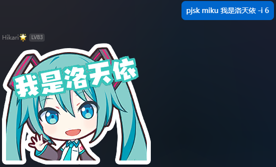

<h1 align="center">Project Sekai Stickers</h1>

<div align="center">


<strong>在QQ平台快速创建你的PJSK表情贴纸！</strong>

</div>

## 🔐 素材来源

👉 原始贴纸来自 [Reddit](https://www.reddit.com/r/ProjectSekai/comments/x1h4v1/after_an_ungodly_amount_of_time_i_finally_made/)

👉 剪切图像来自 [Modder4869](https://github.com/Modder4869)

👉 原网站来自 [sekai-stickers](https://github.com/TheOriginalAyaka/sekai-stickers) by [TheOriginalAyaka](https://github.com/TheOriginalAyaka)

## 🚀 快速开始

### 插件安装

方法一：管理员账号安装

配置完成 [LangBot](https://github.com/RockChinQ/LangBot) 主程序后使用管理员账号向机器人发送命令即可安装：

```
!plugin get https://github.com/AmethystTim/ProjectSekaiStickers.git
```
或查看详细的[安装说明](https://docs.langbot.app/insight/guide)

方法二：插件市场安装

启动`LangBot`后访问`Langbot webui`（默认为`127.0.0.1:5300`），进入**插件市场**，搜索`ProjectSekaiStickers`进行安装

### 网络配置

> 目前仅支持NapCat消息平台

访问`NapCat`消息平台的webui（默认为`http://127.0.0.1:6099`）

在**网络配置**栏目中新建**HTTP服务器**，主机填写`127.0.0.1`，端口填写`3000`

## 🧭 指令说明

|指令|说明|可选参数|示例|
|:--:|:--:|:-----:|:--:|
|`pjsk`|查看帮助信息|-||
|`pjsk ls`|查看所有角色|-||
|`pjsk ls [角色名]`|查看某角色的所有可用底图|-|`pjsk ls miku`|
|`pjsk [角色名] [文本]`|创建PJSK表情贴纸|底图序号 `-i`，字体大小 `-font`|`pjsk miku 我是洛天依 -i 6 -font 48`|

## ✨ 演示

<div align="center">




</div>

## TODO

- [ ] 更正角色应援色
- [ ] 自定义文本旋转角度
- [ ] 自定义文本坐标

## 📄 License

使用**MIT许可证**